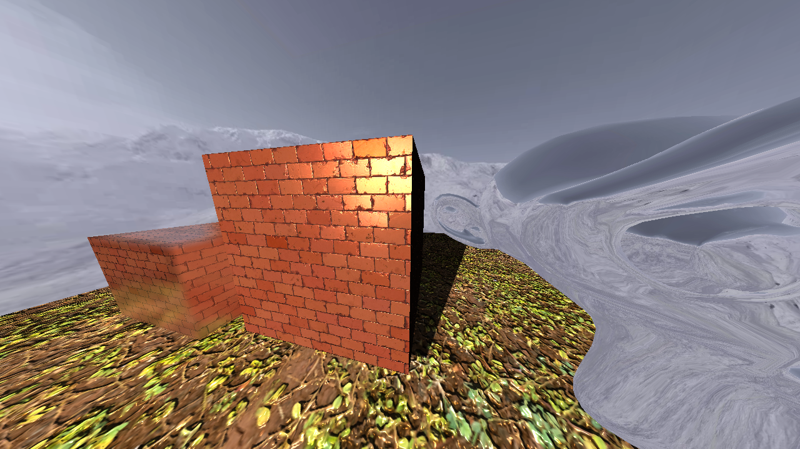

## Utopia Engine

This project was a part of my last high school assignment (Gymnasiearbete). It was created in October 2019 and had it's latest main feature implemented December the same year. The main goal of the project was to learn about different algorithms for handling lights and shadows in 3D computer graphics. I had minor experience with C++ prior to this project, and was mostly familiar with Java and C#.
The project started by following a Youtube tutorial from ["thebennybox"](https://www.youtube.com/watch?v=ftiKrP3gW3k&list=PLEETnX-uPtBXT9T-hD0Bj31DSnwio-ywh) which gave me an introduction to how OpenGL and realtime rendering works. 
After the tutorial, I used different resources such as [learnopengl.com](https://learnopengl.com/) to further expand upon the project and implement the different algorithms.

## Main Features
* Phong shading
* Normal mapping
* Shadow mapping
* Reflections with cube maps
* Screen space reflections

## The Scene
Different meshes were constructed to present the implemented algorithms. The objects are:
* A cube in the middle and a plane below which showcases phong shading, normal mapping and shadow mapping
* A second cube to showcase screen space reflections
* A monkey head to showcase reflections with cube maps
* A skybox to show generic rendering with cube maps

## Running The Project
It is recommended to use Visual Studio 2017 or 2019. While both x64 and x86 builds, x86 was more thoroughly tested when developing the project.

A first-person camera can be controlled when running the project. "WASDEQ" keys will move the camera while the mouse will rotate it. Pressing "R" will switch between the final and default shaders to visualize how the implemented algorithms affects the scene.

## Report
A report was written as part of the school assignment. It goes in detail about each feature listed above. You can [read it here](https://drive.google.com/file/d/13NIolz76D7zeJDDkTpxawwOKp9tclkq_/view?usp=sharing) (it's in swedish).
